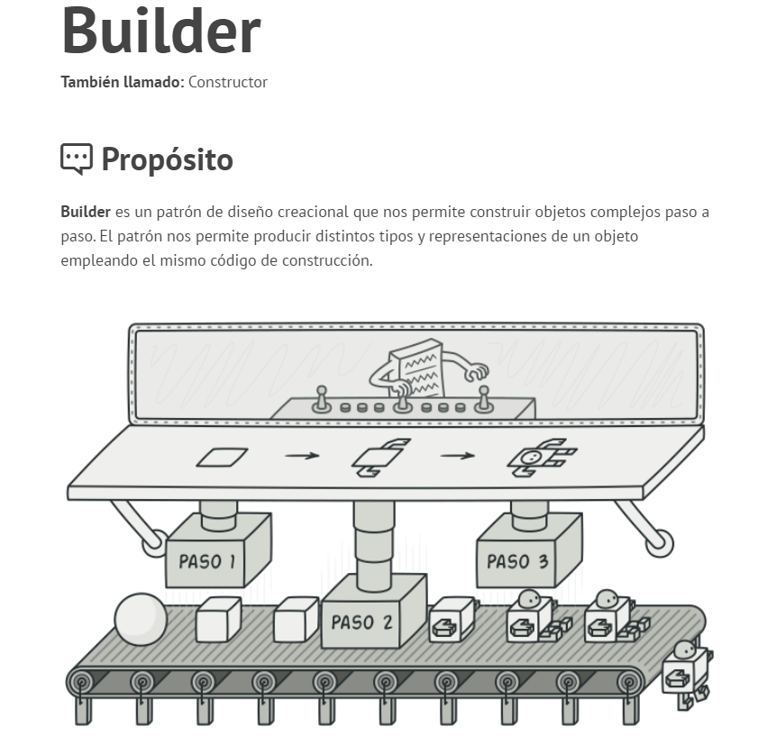
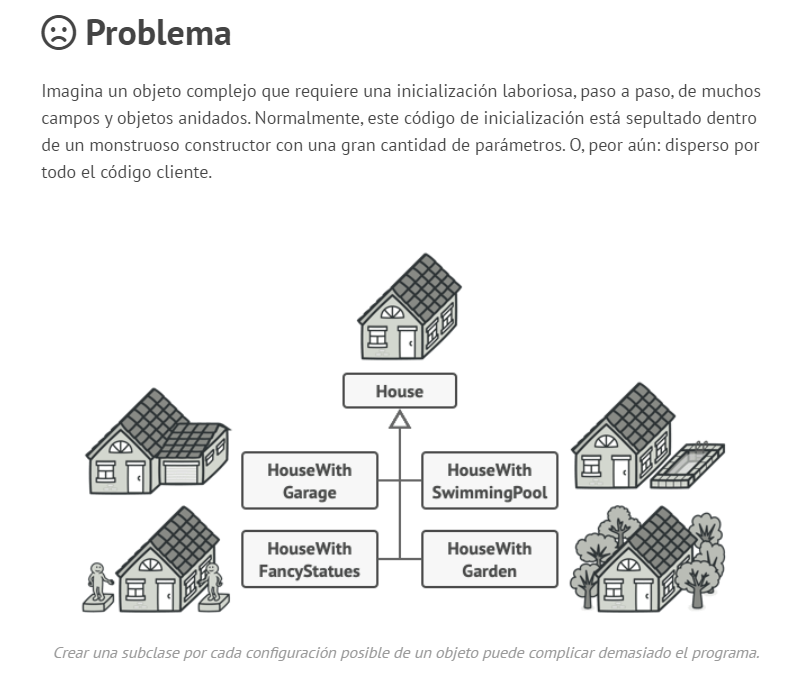
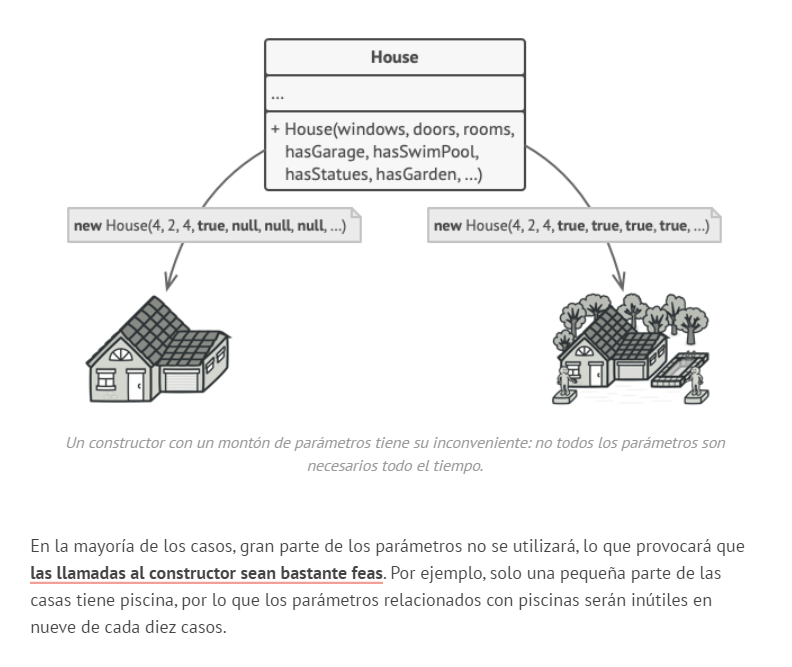
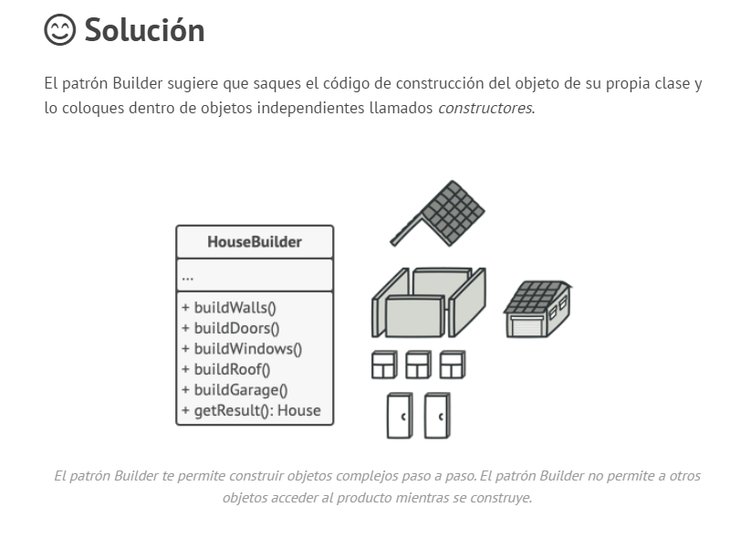

# Patron de diseño Builder

Creacion y uso del patron de diseño Builder

# Patrones creacionales
Mas detalles sobre los patrones de diseño en la siguiente pagina 👉[Refactoring.Guru](https://refactoring.guru/es/design-patterns) 